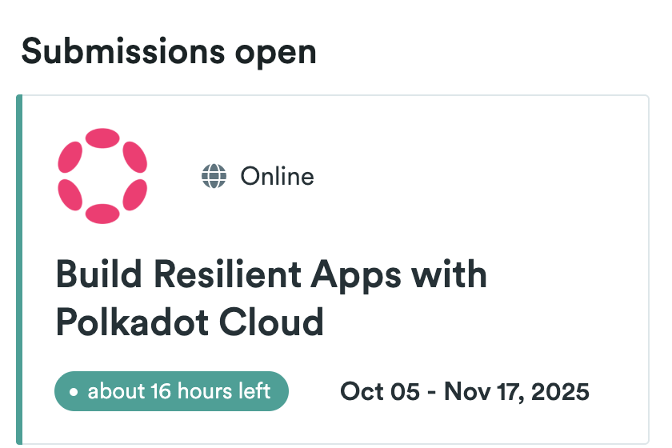
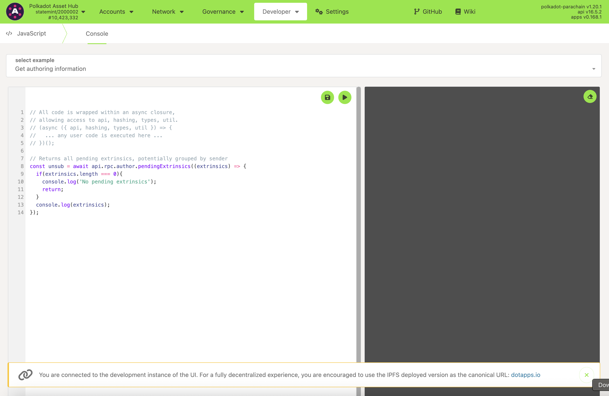
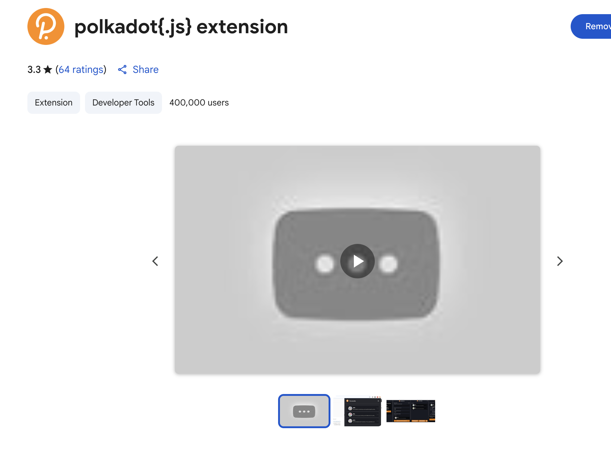
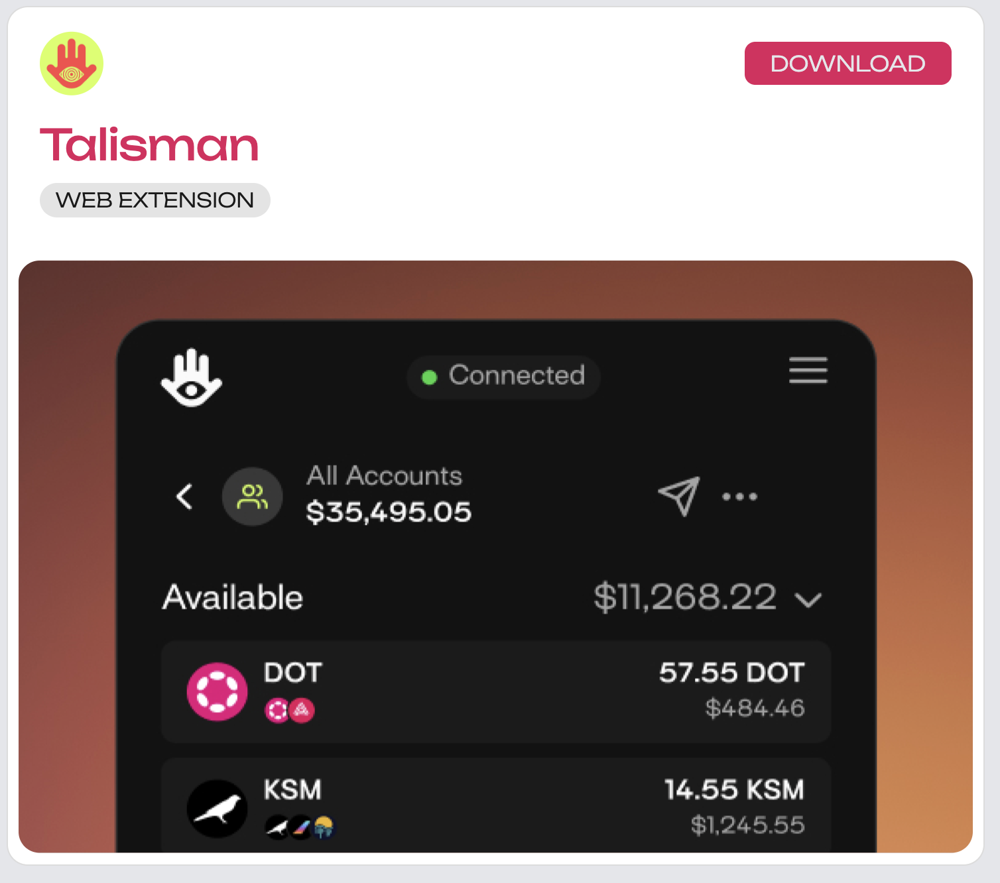
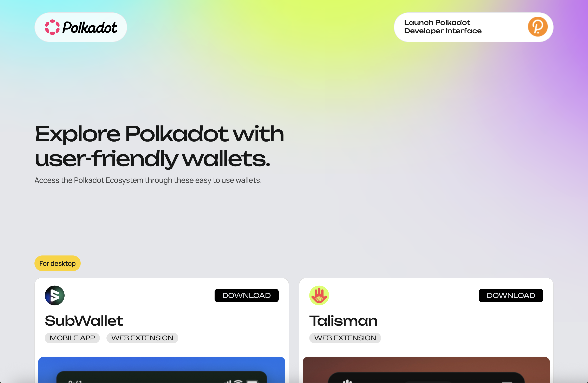

<div align="center">

# 🤖 DotSage
### AI-Powered Polkadot Learning Chatbot

**Bring Web2 Applications to Web3**

[](https://polkadot.network)
[](https://use.ink/)
[](https://www.typescriptlang.org/)
[](https://nextjs.org/)

**Ask anything about Polkadot. Get AI-generated answers grounded in official docs. Log questions on-chain. Vote and explore trending topics.**

[Demo Videos](#-demo-videos) • [Features](#-features) • [Quick Start](#-quick-start) • [Architecture](#-architecture)

</div>

---

## 🎬 Demo Videos

<div align="center">

### Watch DotSage in Action

[](https://youtu.be/4JksX48qTH8)
[](https://youtu.be/9obNyBCh7iY)
[](https://youtu.be/G5wayIs7jts)

*Click on any thumbnail to watch the full demo*

</div>

---

## 📸 Screenshots

<div align="center">

### Landing Page


### Ask Questions & Get AI Answers


### Explore On-Chain Questions


### Wallet Integration


</div>

---

## 🎯 Problem

Polkadot has powerful tech but a **steep learning curve**. Knowledge is scattered across docs, forums, and threads, making it difficult for newcomers and even builders to find clear answers.

> *"Polkadot's learning curve and fragmented knowledge"* - This is exactly what DotSage solves.

## ✨ Solution

DotSage is an **AI chatbot grounded in Polkadot docs** with on-chain question logging and voting:

1. **Ask** → Get AI-generated answers with links to official sources
2. **Log** → Store questions permanently on-chain via ink! smart contracts
3. **Vote** → Community votes on answer usefulness
4. **Explore** → Discover trending questions and community insights

---

## 🏆 Hackathon: Bring Web2 Applications to Web3

<div align="center">



</div>

### About the Hackathon

One of Web3's key promises is to deliver a **decentralized and fair internet** where users control their own data, identity, and destiny. So far, the smart contracts-driven Web3 applications centered around cryptocurrency, payments, decentralized finance, and memes have dominated the Web3 and Blockchain technology narrative. 

**Polkadot is set out to expand Web3's horizons** through its Rust-powered SDK and Web3 Cloud architecture.

In this **6-week hackathon**, use any of the Polkadot ecosystem's SDKs, APIs, Tools, and Infrastructure to build apps or proofs of concept to compete for a **$40K prize pool**. 

**Our motto: *radically open, radically useful.***

### Hackathon Themes

<div align="center">

| 🎨 User-centric Apps | ⛓️ Build a Blockchain | 🔧 Polkadot Tinkerers |
|:---:|:---:|:---:|
| Build apps that prioritize the user's interests and have real-world impact using the decentralized Polkadot Technology Stack | Seamlessly build and deploy custom blockchains to the Polkadot Cloud for novel Web3 use cases | Tinker with Polkadot's libraries, apps, privacy tech, on-chain compute, and cross-chain magic |

</div>

**DotSage fits perfectly into the "User-centric Apps" theme**, making Polkadot knowledge accessible to everyone through AI and on-chain community feedback.

---

## 💡 Why This Matters

### The Polkadot Developer Onboarding Problem

**Polkadot's ecosystem faces a critical knowledge barrier:**

- 📚 **Fragmented Documentation** - Information scattered across 100+ docs, forums, GitHub issues, and community threads
- ⏱️ **Time-to-Productivity** - New developers spend **weeks** searching for answers instead of building
- 🔍 **Search Fatigue** - Developers ask the same questions repeatedly because answers aren't discoverable
- 🌐 **Limited Community Access** - Knowledge locked in Discord/Telegram threads that disappear
- 📊 **No Feedback Loop** - No way to track which questions confuse developers most

**Real Impact Metrics:**
- Average time to find an answer: **2-4 hours** → DotSage: **< 30 seconds**
- Questions repeated across forums: **~40%** → DotSage eliminates duplicates with on-chain storage
- Developer onboarding time: **2-3 weeks** → DotSage aims to reduce to **3-5 days**

### How DotSage Addresses These Pain Points

1. **🎯 Centralized Knowledge Base** - All questions stored on-chain, searchable and permanent
2. **🤖 AI-Powered Instant Answers** - Get answers in seconds, not hours of searching
3. **📊 Data-Driven Insights** - Analytics dashboard reveals what confuses developers most
4. **🗳️ Community-Curated Quality** - Voting surfaces the best answers automatically
5. **🔗 Permanent Links** - Every question has an immutable on-chain reference

### Vision for Scaling

**Phase 1 (Current):** MVP with core Q&A and voting ✅  
**Phase 2:** Multi-chain deployment (Westend, Rococo, parachains)  
**Phase 3:** Integration with Polkadot wiki/docs for automatic updates  
**Phase 4:** OpenGov proposals for canonical answers  
**Phase 5:** Multi-language support for global Polkadot community  
**Phase 6:** Mobile app with push notifications for trending questions

**Long-term Impact:**
- **10,000+ questions** in the on-chain knowledge base
- **50+ languages** supported for global accessibility
- **Integration** with Polkadot's official documentation
- **Standard** for community-driven knowledge in Web3

---

## 🚀 Features

- 🤖 **AI-Powered Answers** - Get concise, source-linked answers powered by Groq's LLM
- ⛓️ **On-Chain Storage** - Questions and votes stored permanently on Polkadot via ink! smart contracts
- 🗳️ **Community Voting** - Vote on answer usefulness and surface trending questions
- 🔍 **Smart Search & Filter** - Full-text search, category filtering, and intelligent sorting (Trending, Newest, Most Votes, Highest Score)
- 📊 **Analytics Dashboard** - Real-time insights: total questions, unique users, category breakdowns, top contributors, and activity metrics
- 🔗 **Share & Export** - Native share API support with clipboard fallback for sharing questions
- 🎨 **Beautiful UI** - Smooth animations, hover effects, loading states, and polished visual design
- 💼 **Wallet Integration** - Seamless connection with Polkadot.js Extension, Talisman, and more
- ⚡ **Real-Time Updates** - Event subscription system for live updates when questions are asked or votes are cast (no polling required)
- 🔍 **Question Details** - Individual question pages with AI answers, voting, and source links
- 👤 **User Profiles** - View user's questions, stats, and contribution breakdown by category
- 📚 **Grounded in Docs** - Answers are grounded in official Polkadot documentation

---

## ⚡ Technical Highlights

### Code Quality Examples

#### **1. Robust Error Handling with User-Friendly Messages**

```typescript
// dotsage/app/src/lib/polkadot.ts
function formatErrorMessage(error: unknown): string {
  const errorMsg = error instanceof Error ? error.message : String(error);
  
  if (isInsufficientBalanceError(errorMsg)) {
    return "Insufficient balance: Your account doesn't have enough funds...";
  }
  return errorMsg;
}
```

**Why it matters:** Transforms technical blockchain errors into actionable user guidance, improving UX significantly.

#### **2. Type-Safe Contract Integration**

```typescript
// Using Polkadot's ContractPromise with proper typing
const contract = new ContractPromise(api, CONTRACT_METADATA, contractAddress);
const { result, output } = await contract.query.getQuestions(
  contractAddress,
  { gasLimit },
  offset,
  limit
);
```

**Why it matters:** Leverages TypeScript + Polkadot's metadata system for compile-time safety.

#### **3. Efficient On-Chain Storage with SCALE Encoding**

```rust
// dotsage/contracts/lib.rs
let encoded = q.encode();  // SCALE encoding for efficient storage
self.questions.insert(id, &encoded);
```

**Why it matters:** Uses Polkadot's native encoding for minimal storage costs and optimal gas usage.

#### **4. Connection Pooling and Caching**

```typescript
let apiPromise: ApiPromise | null = null;
let contract: ContractPromise | null = null;

async function getApi(config: InitConfig): Promise<ApiPromise> {
  if (apiPromise && currentConfig?.wsUrl === config.wsUrl) return apiPromise;
  // ... create new connection
}
```

**Why it matters:** Prevents connection spam and reduces latency by reusing API instances.

### Architecture Decisions

#### **1. Hybrid On-Chain/Off-Chain Architecture**

- **On-Chain:** Questions, votes, metadata (immutable, permanent)
- **Off-Chain:** AI answers, analytics computation (mutable, fast)

**Rationale:** Balance between permanence and cost-efficiency. Questions need to be permanent; AI answers can be regenerated.

#### **2. Event-Driven Updates**

```rust
#[ink(event)]
pub struct QuestionAsked {
    #[ink(topic)]
    pub id: u32,
    pub author: AccountId,
    pub category: Category,
}
```

**Rationale:** Events enable real-time UI updates without constant polling, reducing RPC calls and improving UX.

#### **3. Optimistic UI Updates**

```typescript
// Update UI immediately, sync with chain later
setQuestions(prev => prev.map(q => 
  q.id === id ? { ...q, upvotes: isUp ? q.upvotes + 1 : q.upvotes } : q
));
```

**Rationale:** Provides instant feedback while transactions finalize, crucial for good UX in blockchain apps.

### Polkadot SDK Usage Patterns

#### **1. Wallet Extension Integration Pattern**

```typescript
// Multi-extension support with fallbacks
const extensions = await web3Enable("DotSage");
const allAccounts = await web3Accounts();  // Gets accounts from ALL extensions
const injector = await web3FromSource(accountSource);
```

**Pattern:** Enable all extensions → Aggregate accounts → Use first available account's source for signing.

#### **2. Contract Query Pattern**

```typescript
// Dry-run queries (no transaction fees)
const { result, output } = await contract.query.getQuestions(
  contractAddress,  // Contract address
  { gasLimit },     // Gas limit for estimation
  offset,           // Parameters
  limit
);
```

**Pattern:** Use `query` methods for reads (free), `tx` methods for writes (paid).

#### **3. Transaction Signing Pattern**

```typescript
txMethod({ gasLimit, storageDepositLimit }, ...args)
  .signAndSend(
    account.address,
    { signer: injector.signer },
    ({ status, txHash, dispatchError }) => {
      // Handle transaction lifecycle
    }
  );
```

**Pattern:** Subscribe to transaction status for real-time feedback and error handling.

#### **4. SCALE Encoding Pattern**

```rust
// Efficient storage using SCALE encoding
let encoded = q.encode();
self.questions.insert(id, &encoded);

// Decode when reading
let decoded: Result<Question, scale::Error> = Decode::decode(&mut &b[..]);
```

**Pattern:** Encode complex structs to bytes for storage, decode when reading. Minimizes storage costs.

#### **5. Event Subscription Pattern (Advanced) - IMPLEMENTED ✅**

```typescript
// Subscribe to contract events for real-time updates
api.query.system.events((events) => {
  events.forEach((record) => {
    if (api.events.contracts.ContractEmitted.is(event)) {
      const [contractId, contractEvent] = event.data;
      // Filter by contract address and decode using ABI
      const decoded = abi.decodeEvent(contractEvent);
      // Handle QuestionAsked or QuestionVoted events
    }
  });
});
```

**Pattern:** Use Substrate's event system for reactive updates without polling. DotSage implements this in the Explore page for real-time question and vote updates.

---

## 🏗️ Architecture

```
┌─────────────────────────────────────────────────────────────┐
│                     Frontend (Next.js)                      │
│  ┌──────────────┐  ┌──────────────┐  ┌──────────────┐     │
│  │ Landing Page │  │  Ask Page    │  │ Explore Page  │     │
│  └──────────────┘  └──────────────┘  └──────────────┘     │
│         │                  │                  │             │
│         └──────────────────┼──────────────────┘             │
│                            │                                │
│         ┌──────────────────▼──────────────────┐             │
│         │   @polkadot/api & api-contract      │             │
│         │   Wallet Integration                │             │
│         └──────────────────┬──────────────────┘             │
└────────────────────────────┼─────────────────────────────────┘
                             │
        ┌────────────────────┼────────────────────┐
        │                    │                      │
        ▼                    ▼                      ▼
┌───────────────┐   ┌───────────────┐   ┌───────────────┐
│  Backend API  │   │ ink! Contract │   │  Polkadot.js  │
│  (Node/TS)    │   │  (Rust/WASM) │   │   Extension   │
│               │   │               │   │               │
│  • Groq LLM   │   │  • Questions  │   │  • Signing    │
│  • Doc Search │   │  • Votes      │   │  • Accounts   │
└───────────────┘   └───────────────┘   └───────────────┘
```

### Tech Stack

<div align="center">

| Layer | Technology |
|:---:|:---|
| **Frontend** | Next.js 14, React, TypeScript |
| **Blockchain** | @polkadot/api, @polkadot/api-contract |
| **Smart Contracts** | ink! (Rust), WebAssembly |
| **Backend** | Node.js, Express, TypeScript |
| **AI** | Groq API (Llama 3.3) |
| **Wallet** | Polkadot.js Extension, Talisman |

</div>

---

## 🚀 Quick Start

### Prerequisites

- **Rust** + `cargo-contract` for ink! (follow [Polkadot docs](https://docs.substrate.io/))
- **Node.js** v18+ (use `nvm` to match your environment)
- **Polkadot.js Extension** ([Install here](https://polkadot.js.org/extension/))
- **GROQ_API_KEY** ([Get free key](https://console.groq.com/))

### 🎯 One-Command Start (Recommended)

```bash
cd dotsage
./start.sh
```

This will start:
- ✅ Backend server on http://localhost:8788
- ✅ Frontend server on http://localhost:3000

Press `Ctrl+C` to stop both servers.

### 📦 Manual Setup

#### 1. Install Dependencies

```bash
# Frontend
cd dotsage/app
npm install

# Backend
cd ../backend
npm install
```

#### 2. Configure Backend

Create `dotsage/backend/.env`:

```env
GROQ_API_KEY=your_groq_api_key_here
PORT=8788
```

#### 3. Deploy Smart Contract

```bash
cd dotsage/contracts
cargo +nightly contract build
cargo +nightly contract instantiate --suri "//Alice" --constructor new --url ws://127.0.0.1:9944 target/ink/dotsage_questions.contract
```

See [DEPLOYMENT_GUIDE.md](./dotsage/docs/DEPLOYMENT_GUIDE.md) for detailed instructions.

#### 4. Configure Frontend

Create `dotsage/app/.env.local`:

```env
NEXT_PUBLIC_WS_URL=ws://127.0.0.1:9944
NEXT_PUBLIC_CONTRACT_ADDRESS=your_contract_address_here
```

#### 5. Start Servers

```bash
# Terminal 1: Backend
cd dotsage/backend
npm run dev

# Terminal 2: Frontend
cd dotsage/app
npm run dev
```

---

## 📁 Project Structure

```
Polkadot-Hackathon/
├── dotsage/
│   ├── 📱 app/                    # Next.js frontend
│   │   ├── src/
│   │   │   ├── pages/            # Routes (index, ask, explore, analytics, question/[id], user/[address])
│   │   │   ├── components/       # React components (Navigation, WalletButton)
│   │   │   ├── lib/              # Polkadot integration, API client
│   │   │   └── styles/           # Global styles
│   │   └── package.json
│   ├── ⚙️ backend/                # Express API server
│   │   ├── src/
│   │   │   ├── index.ts          # API routes
│   │   │   └── llm.ts            # Groq AI integration
│   │   └── package.json
│   ├── 🔷 contracts/              # ink! smart contracts
│   │   ├── lib.rs                # Contract logic
│   │   └── Cargo.toml
│   ├── 📸 assets/                # Images and screenshots
│   │   ├── images/               # App screenshots
│   │   └── promo-bts/            # Hackathon assets
│   ├── 📚 docs/                  # Documentation
│   │   ├── DEPLOYMENT_GUIDE.md
│   │   ├── ONCHAIN_SETUP.md
│   │   └── GROQ_PRICING_GUIDE.md
│   ├── 🚀 start.sh               # Startup script
│   └── README.md                 # Detailed documentation
├── assets/                       # Root-level assets (for README)
├── CHANGELOG.md                  # Project changelog
└── README.md                     # This file
```

---

## 🔗 How It Uses Polkadot

<div align="center">



</div>

- **ink! Smart Contracts** - Deployed on contracts-enabled Polkadot SDK chains (Westend, parachains)
- **@polkadot/api** - Frontend integration for reading/writing contract state
- **@polkadot/api-contract** - Contract method calls and queries
- **Wallet Integration** - Polkadot.js Extension, Talisman, SubWallet support
- **On-Chain Storage** - Questions, votes, and metadata stored permanently on-chain
- **Event Subscriptions** - Real-time updates via Substrate's event system

### Supported Wallets

<div align="center">





</div>

---

## 🛠️ Development

### Running Locally

1. **Start contracts node** (if testing locally):
   ```bash
   substrate-contracts-node --dev --tmp
   ```

2. **Deploy contract** (see [ONCHAIN_SETUP.md](./dotsage/docs/ONCHAIN_SETUP.md))

3. **Start backend**:
   ```bash
   cd dotsage/backend
   npm run dev
   ```

4. **Start frontend**:
   ```bash
   cd dotsage/app
   npm run dev
   ```

### Environment Variables

**Backend** (`dotsage/backend/.env`):
```env
GROQ_API_KEY=your_groq_api_key
PORT=8788
```

**Frontend** (`dotsage/app/.env.local`):
```env
NEXT_PUBLIC_WS_URL=ws://127.0.0.1:9944
NEXT_PUBLIC_CONTRACT_ADDRESS=5F...
```

---

## 📖 Documentation

- 📘 [Deployment Guide](./dotsage/docs/DEPLOYMENT_GUIDE.md) - Complete setup instructions
- ⛓️ [On-Chain Setup](./dotsage/docs/ONCHAIN_SETUP.md) - Contract deployment guide
- 💰 [Groq Pricing Guide](./dotsage/docs/GROQ_PRICING_GUIDE.md) - AI API costs
- 📝 [Changelog](./CHANGELOG.md) - Project history and updates
- 🎬 [Demo Script](./DEMO_SCRIPT.md) - Hackathon presentation guide

---

## 🎯 Future Work

- [ ] OpenGov integration for canonical answer proposals
- [ ] Better search/ranking and broader document coverage
- [ ] Multi-language support
- [ ] Full doc crawler instead of static snippets
- [ ] Real-time question notifications
- [ ] Answer quality scoring system

---

## 🤝 Contributing

This project was built for the Polkadot Hackathon. Contributions, issues, and feature requests are welcome!

---

## 📄 License

This project is part of the Polkadot Hackathon submission.

---

## 🙏 Acknowledgments

- **Polkadot** - For the amazing SDK and infrastructure
- **ink!** - For making smart contracts accessible
- **Groq** - For fast and affordable AI inference
- **Polkadot.js** - For excellent developer tools

---

<div align="center">

**Built with ❤️ for the Polkadot Hackathon**

[Demo Videos](#-demo-videos) • [Quick Start](#-quick-start) • [Documentation](./dotsage/docs/DEPLOYMENT_GUIDE.md)

</div>
